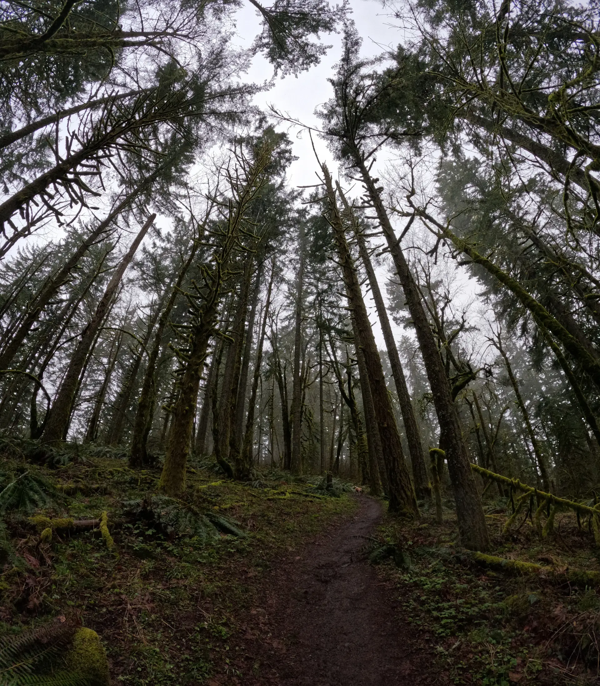
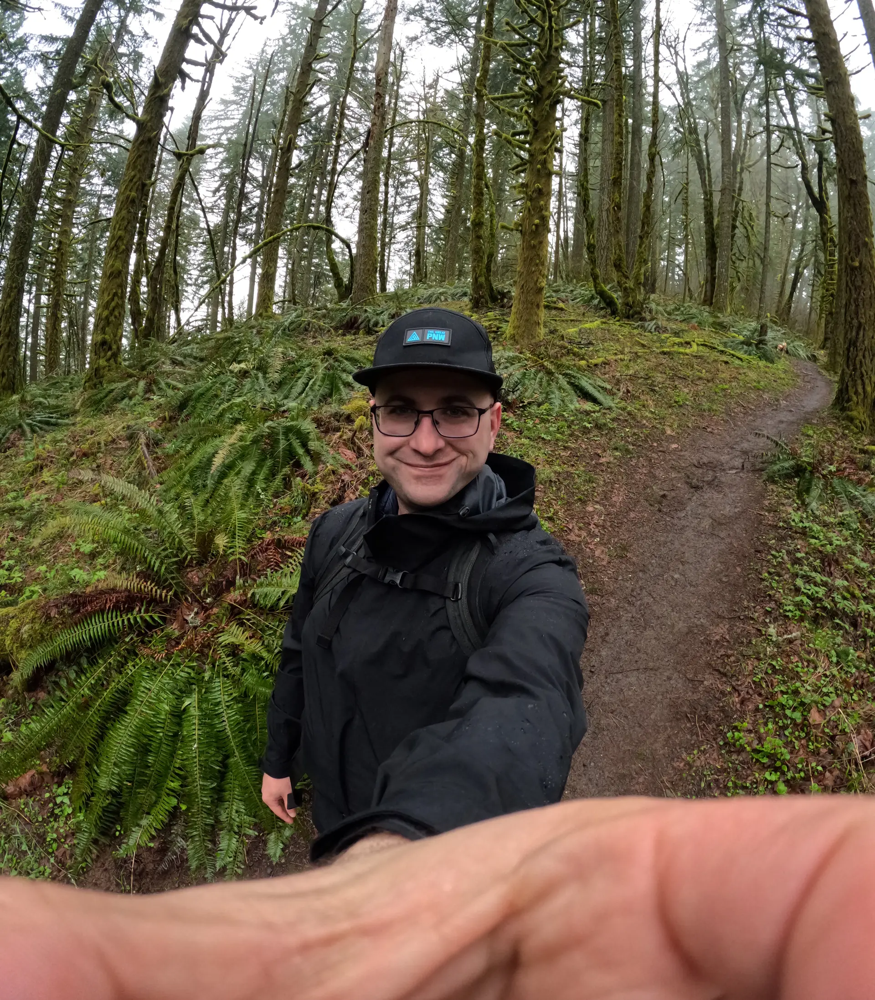
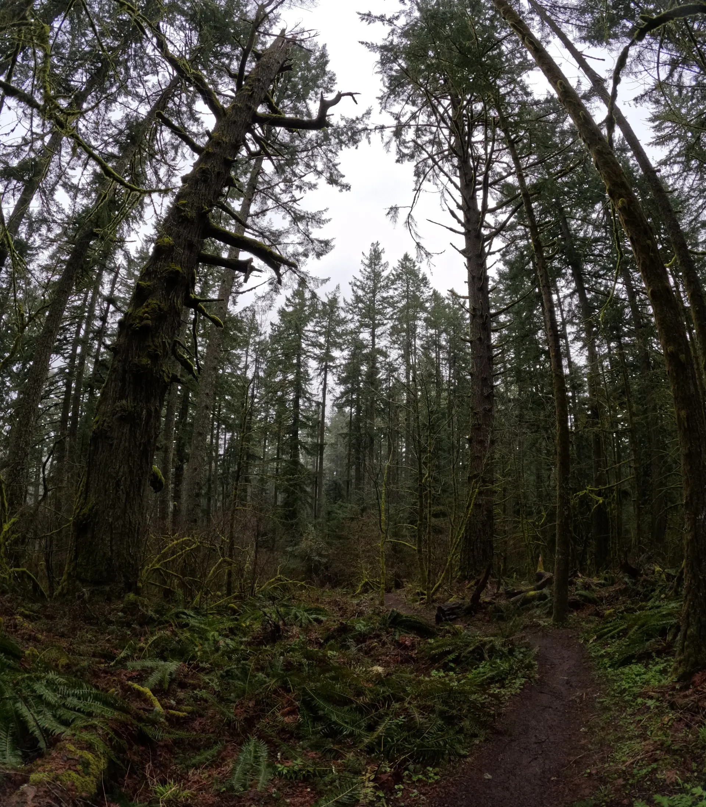
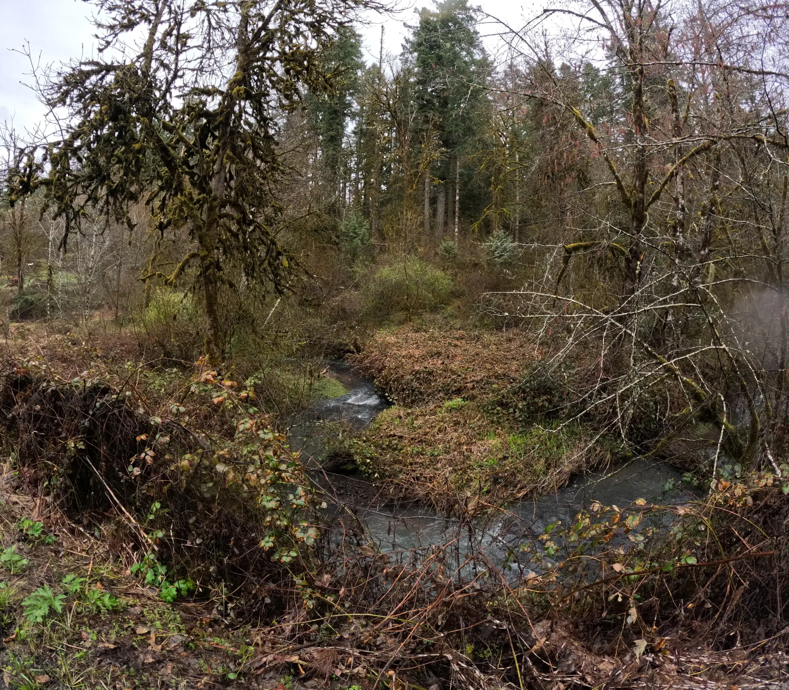

# Ridge Trail to Sulphur Springs Loop Trail, McDonald-Dunn Forest

**All Trails Link:** https://www.alltrails.com/trail/us/oregon/ridge-trail-to-sulphur-springs-loop-trail

**Length:** 5.8 miles

## Description

Discover this 3.5-mile loop trail near Corvallis, Oregon. Generally considered a moderately challenging route, it takes an average of 1 h 51 min to complete. This trail is great for birding, hiking, and mountain biking, and it's unlikely you'll encounter many other people while exploring. Dogs are welcome and may be off-leash in some areas.

## Trailhead

Lewisburg Saddle Trailhead, 2778 NW Sulphur Springs Rd, Corvallis, OR 97330

## Photos

